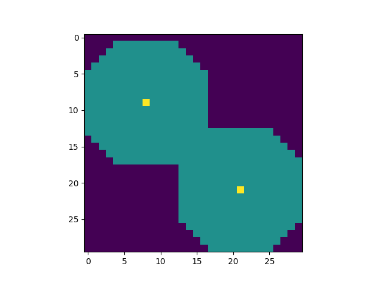

SHO — Stochastic Heuristics Optimization
========================================

SHO is a didactic Python framework for implementing metaheuristics
(or evolutionary computation, or search heuristics).

The framework implements a simple sensor placement problem
and handle metaheuristics manipulating solutions represented as
numerical vectors or bitstrings.

Exemple (2 sensors)



The task proposed by Johann Dreo <johann.dreo@thalesgroup.com> ⓒ Thales group


Architecture
------------

The design pattern of the framework is a functional approach to composition.

### Operators

The base of the pattern is a function that contains the main loop
of the algorithm, and call other functions called "operators".
Example of those algorithms are in the `algo` module.

For instance, the `random` algorithm depends on an objective function `func`,
an initialization operator `init` and a stopping criterion operator `again`.


### Interface capture

As they are assembled in an algorithm that do not know their internal
in advance, an operators needs to honor an interface.
For instance, the `init` operator's interface takes no input parameter
and returns a solution to the problem.

However, some operator may need additional parameters to be passed.
To solve this problem, the framework use an interface capture pattern,
implemented in the `make` module.
Basically, a function in this module capture the operator function's full
interface and returns a function having the expected interface of the
operator.

The implicit rule is to use positional arguments for mandatory parameters
on which the operator is defined, and keyword arguments for parameters
which are specific to the operator.

Executable
----------
Comparison of the convergence of algorithms is implemented in `ert.py`.
By default this file consists two parts:
1. Find optimal solution and save all intermediate results of the function in defined file.
2. Parsing existing files and building a distribution

**Important**: If the data files already exist, you need to comment 
out the following line in `ert.py` so that there is no re-writing
```
find_optimal(nrun=nrun, execute=exec)
```

There are 5 parameters in `ert.py` that can be modified
```
nrun = 20
solvers = ["genetic", "num_random", "num_greedy"]
threshold = 495.0
nsensors = 2

result_dir = str(nsensors) + "sensors_result_" + selected
```
*nrun* determines the number of times the algorithm is run.

*solvers* is list of algorithms to execute. We compare the distributions of these algorithms.

*threshold* is a parameter used in building of distributions.

*nsensors* defines the number of sensors in the optimization problem.

*result_dir* is the name of result folder. Can be modified just the second part (`selected` and `str(nsensors)` are used by default).

##### Attention
1. If more than 1 algorithm is defined in list *solvers*, including **genetic**, 
so it must be on the 1st position in this list.
2. If you re-run the algorithm with existing data files, the algorithm adds entries to the end, 
rather than overwriting them

The main interface is implemented in `snp.py`.

Running examples
---------

To run the algorithms, execute following command
```
python ert.py
```


Results
-------
We have implemented 3 algorithms with the same objective function
- Genetic algo
- Num greedy
- Random greedy

Consider the probability distribution of getting a value at least as the threshold, 
depending on the number of function calls.

#### 2 sensors


#### 3 sensors


#### 4 sensors


Disccussion
-----------

In this work, we tried to explore the convergence of algorithm to finding optimal solution. 
 
The main idea of this problem was to implement an algorithm that could be more productive than *random*.
Considering in our case the *Genetic* algorithm, the number of function calls depends directly on the population size and the number of parents.
We implemented *Genetic* algo with a little modification in order to increase its performance - we are artificially reducing the population size.
But our reducing appears after the first iteration and then size of population doesn't change.
As we can see, *Genetic* beat other algorithms for performance and he needs not a lot of function calculations.
In our case, we initialize the population size n=100, then it is 30. If we have 50 iterations:
`1*100 + 49*28 = 1472`function calls, or `50*100 = 5000`function calls.
Of course, in the first case, the algorithm will finish the calculations faster 
and as the experience shows, we will get the optimal value quickly enough.

If we initialize a large enough population, we are more likely to get individuals with different genes, 
which will make the population more variable.

In the future, it can be interesting to dynamically change the population size.

